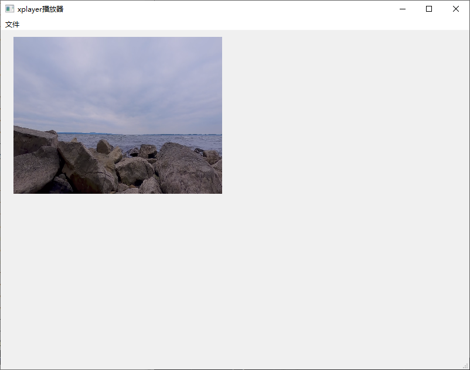

# xplayer

## 2学习hplayer

### 2.1 分支 ffmpeg_play_2_5 
功能： 初始化界面
[ffmpeg播放器6(从2-5的实现)](https://juejin.cn/post/7502329326098333705)

### 2.2 分支 ffmpeg_play_7_11 
功能： 线程以及解码
[ffmpeg播放器12(从7-11的实现)-上](https://juejin.cn/post/7504878700553060402)

### 2.3 分支 ffmpeg_play_13_15 
功能：解码以及视频帧存储
[ffmpeg播放器16(从13-15的实现)-上](https://juejin.cn/post/7507554645227028507)

### 2.4 分支 ffmpeg_play_17_19 
功能：gl渲染一帧视频
[ffmpeg播放器20(从17-19的实现)](https://juejin.cn/post/7510587921788207144)

效果:

### 2.5 分支 ffmpeg_play_21 
功能：正常播放视频,无音频
[ffmpeg播放器21](https://juejin.cn/post/7512745040306520099)

效果:
